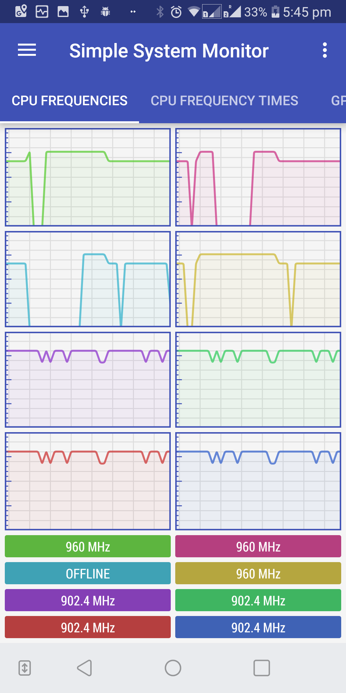
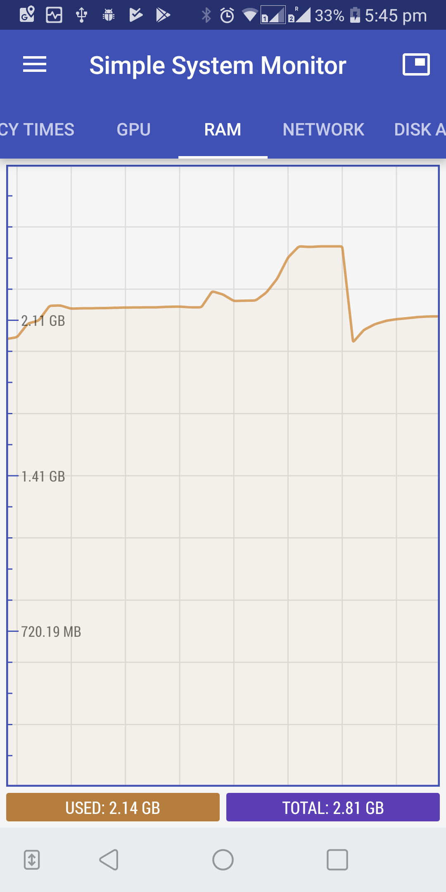

Once my laptop completely died and did not have much to do until the new laptop arrived. But I had my Android mobile phone and wondered how hard will it be to get some common ONT bioinformatics tools working there. On that day, I with my friend [@danielltb](https://github.com/danielltb)  realised that is not that hard (but in a very hacky way). Here are the steps, if anyone is crazy enough to attempt it. Interestingly, this method does NOT require a rooted phone[^1].

First, be warned that this is a very hacky method and is solely for testing out. In summary, we generate a completely statically linked binary on an ARM based single board computer running Linux. The method is only for tools written in C/C++. I will show steps for four examples, namely [minimap2](https://github.com/lh3/minimap2), [samtools](http://www.htslib.org/), [f5c](https://github.com/hasindu2008/f5c/) and [nanopolish](https://github.com/jts/nanopolish).

Then statically linked binaries which we generated can be downloaded from [here](../data/2019-6-15-armv7-binaries.zip).
The sample data[^2] for the following examples can be downloaded from [here](../data/2019-6-15-2019-6-15-sampledata.zip)

# Requirements

- A mobile phone running Android. Does not require rooting[^1]. My phone used for testing was a cheap [LG Q6](https://www.gsmarena.com/lg_q6-8756.php) running Android 7.
- An ARM based single board computer (will call it SBC here onwards) running Linux. We used an [Odroid XU4](https://wiki.odroid.com/odroid-xu4/odroid-xu4) running Ubuntu 16.04.4 LTS.
- A USB cable to connect your phone. Optionally a host computer (laptop or a desktop) to connect the phone. Even the SBC can be used as the host.

You might wonder if the mobile phone and the SBC) should have the same ARM architecture (i.e. ARMv7 or ARMv8). Not necessarily. The LG Q6 mobile phone had an ARMv8 (Octa-core 1.4 GHz Cortex-A53) processor architecture while the Odroid XU4 had ARMv7 (Cortex-A15 2Ghz and Cortex-A7 Octa core). However, the mobile phone despite its ARMv8 64-bit processor, was still running a 32-bit version of the OS, thus running `cat /proc/cpu` on the phone through Android Debug Bridge (ADB) output the following (a similar outcome to that on a latest Raspberry Pi with ARMv8 processor running the 32-bit Raspbian).

```sh
mh:/data/local/tmp $ cat /proc/cpuinfo
processor       : 0
model name      : ARMv7 Processor rev 4 (v7l)
BogoMIPS        : 38.40
Features        : half thumb fastmult vfp edsp neon vfpv3 tls vfpv4 idiva idivt vfpd32 lpae evtstrm aes pmull sha1 sha2 crc32
CPU implementer : 0x41
CPU architecture: 7
CPU variant     : 0x0
CPU part        : 0xd03
CPU revision    : 4
```

In case your mobile is running a 64-bit OS, you might need an SBC running 64-bit as well.

# steps

1. Setup the Android Debug Bridge (ADB)

You have to setup your host computer to be able to connect to your phone through ADB. There are a number of tutorials for this on the Internet which you can follow. For example https://devsjournal.com/download-minimal-adb-fastboot-tool.html. Note that this step might slightly vary for different Android phones. This is the summary of what we did :

- Installed the minimal version of ADB. The ADB command line tool comes with the Android SDK, but we preferred the minimal version of ADB as it is light weight. For Windows, you can download minimal ADB from [here](https://forum.xda-developers.com/showthread.php?t=2317790). For Linux, you may use the package manager (eg : `sudo apt-get install android-tools-adb android-tools-fastboot`).

- Installed the USB drivers for the phone. We used the OEM version (through the manufacturer website given [here](https://developer.android.com/studio/run/oem-usb#Drivers). Even the [Universal ADB driver](https://adb.clockworkmod.com/) should work for most phones.

- Enabled developer options on Android and then allowed USB debugging.

-  Connected the phone through USB to the computer. Opened a command line on the computer and issued `adb devices` command. If everything is successful, the phone connected to the computer should be listed.

```dos
C:\Program Files (x86)\Minimal ADB and Fastboot>adb devices
List of devices attached
LGM70059258dab  device
```

If your phone is not listed (usually it happens to me most of the time due to incompatible driver or ADB versions etc) you will have to do a bit of playing around with some patience.

2. Download the source code of the tool onto the SBC and compile with `-static` option to generate a statically linked binary. See examples in the next section.

3. Copy the static binary to the location `/data/local/tmp` of the mobile phone using the `adb push` command. This location `/data/local/tmp` allows us setting executable permissions and running a binary through ADB. This location works up till Android 8.1.0 version. Hopefully will not be restricted in the future versions.

```dos
C:\Program Files (x86)\Minimal ADB and Fastboot>adb push "/path/to/binary" /data/local/tmp/
```

4. Launch an `adb shell` (will give us a shell on the phone) and set executable permission to the binary we just copied. Then you can execute the binary on the phone.

```bash
C:\Program Files (x86)\Minimal ADB and Fastboot>adb shell
mh:/ $ cd /data/local/tmp
mh:/data/local/tmp $ chmod +x binaryname
mh:/data/local/tmp $ ./binaryname
```

# Examples
## minimap2

1. First, download the minimap2 source code on to the SBC. This example uses my fork of minimap2 which was patched to support ARM. You may also use version 2.7 or higher from the [original minimap2 repository](https://github.com/lh3/minimap2/) which supports ARM.
```
wget -O minimap2-arm.tar.gz "https://github.com/hasindu2008/minimap2-arm/archive/v0.1.tar.gz" && tar xvf minimap2-arm.tar.gz && cd minimap2-arm-0.1/
```

2. Open the *Makefile* (located inside the extracted source code directory) using a text editor and get rid of *getopt.o* by changing line 35 and 36 in *Makefile* from

```make
minimap2:main.o getopt.o libminimap2.a
		$(CC) $(CFLAGS) main.o getopt.o -o $@ -L. -lminimap2 $(LIBS)
```
to

```make
minimap2:main.o libminimap2.a
		$(CC) $(CFLAGS) main.o -o $@ -L. -lminimap2 $(LIBS)
```

This is to prevent the potential compilation error in the next step (i.e. multiple definition of `getopt` due to that in *getopt.c* in current folder and the one in *libc*). Note that in latest minimap2 versions, *getopt.c* has been changed to *ketopt.c* and this step is not required.

3. Compile with the `-static` option by passing the `CC` variable in Make as `gcc -static`. You will need to have the dependency *zlib development files* installed (package manager can be used, eg: `sudo apt-get install zlib1g-dev`)

```bash
$ make arm_neon=1 CC="gcc -static"
```

4. Make sure that the generated binary is statically linked

```bash
$ ldd ./minimap2
        not a dynamic executable
```

5. Copy this binary to your mobile phone through ADB. We first copied the binary from the SBC to the laptop and then issued:

```dos
C:\Program Files (x86)\Minimal ADB and Fastboot>adb push "C:\Users\hasindu\Desktop\minimap2" /data/local/tmp/
C:\Users\hasindu\Desktop\minimap2: 1 file pushed. 14.0 MB/s (1470676 bytes in 0.100s)
```

6. Provide executable permissions and launch minimap2 without arguments on your phone to see the usage message.

```bash
C:\Program Files (x86)\Minimal ADB and Fastboot>adb shell
mh:/ $ cd /data/local/tmp
mh:/data/local/tmp $ ls -l minimap2
-rw-rw-rw- 1 shell shell 1470676 2019-06-15 17:31 minimap2
mh:/data/local/tmp $ chmod +x minimap2
mh:/data/local/tmp $ ./minimap2
Usage: minimap2 [options] <target.fa>|<target.idx> [query.fa] [...]
....
```

7. Copy a reference genome and set of reads on to the storage of your mobile phone. We copied chr22  and a set of nanopore reads file onto */sdcard/genome/* on my phone (chr22.fa and 740475-67.fastq in our [test dataset](../data/2019-6-15-2019-6-15-sampledata.zip). You can use `adb push` or the Windows Explorer based phone browser.

8. Now align some reads to the reference. We ran with 4 threads instead of 8 threads as the phone otherwise got laggy. The `-K5M` option to limit the batch size to cap the peak memory (my phone had only 3GB of RAM). Note that chr22 reference is small and fits adequately to 2GB RAM. If you want to align to a full human genome on a limited memory system see our paper [here](https://doi.org/10.1038/s41598-019-40739-8).

```bash
127|mh:/data/local/tmp $ ./minimap2 -x map-ont -a /sdcard/genome/chr22.fa /sdcard/genome/740475-67.fastq -t4 -K5M > /sdcard/genome/reads.sam
[M::mm_idx_gen::8.923*0.99] collected minimizers
[M::mm_idx_gen::10.035*1.27] sorted minimizers
[M::main::10.035*1.27] loaded/built the index for 1 target sequence(s)
[M::mm_mapopt_update::10.394*1.26] mid_occ = 136
[M::mm_idx_stat] kmer size: 15; skip: 10; is_hpc: 0; #seq: 1
[M::mm_idx_stat::10.617*1.26] distinct minimizers: 4817802 (89.47% are singletons); average occurrences: 1.368; average spacing: 7.784
[M::worker_pipeline::18.912*2.37] mapped 493 sequences
[M::worker_pipeline::52.854*2.01] mapped 413 sequences
[M::worker_pipeline::64.470*2.33] mapped 443 sequences
[M::worker_pipeline::109.708*2.07] mapped 457 sequences
[M::worker_pipeline::151.487*2.32] mapped 454 sequences
[M::worker_pipeline::162.448*2.42] mapped 317 sequences
[M::worker_pipeline::174.190*2.52] mapped 410 sequences
[M::worker_pipeline::183.692*2.59] mapped 496 sequences
[M::worker_pipeline::190.814*2.63] mapped 301 sequences
[M::main] Version: 2.11-r797
[M::main] CMD: ./minimap2 -x map-ont -a -t4 -K5M /sdcard/genome/chr22.fa /sdcard/genome/740475-67.fastq
[M::main] Real time: 190.969 sec; CPU: 501.840 sec
```

9. Optionally, observe the CPU and RAM usage by installing a system monitor application on your phone. We used [simple system monitor](https://play.google.com/store/apps/details?id=com.dp.sysmonitor.app&hl=en_AU).




10. When everything is done, check the output file.

```bash
mh:/data/local/tmp $ ls -l /sdcard/genome/740475-67.fastq
-rw-rw---- 1 root sdcard_rw 85784776 2018-06-29 19:39 /sdcard/genome/740475-67.fastq
```

## Samtools

1. Download samtools source code.
```
wget -O samtools.tar.gz "https://github.com/samtools/samtools/releases/download/1.9/samtools-1.9.tar.bz2" && tar -xvf samtools.tar.gz && cd samtools-1.9/
```

2. Compile with `-static`. You need to have dependencies installed or else disable unwanted components through flags to ./configure. See official Samtools installation [documentation](http://www.htslib.org/download/).

```bash
./configure CC="gcc -static" --without-curses
make
```

3. Verify if statically linked.

```bash
$ ldd ./samtools
        not a dynamic executable
```

4. Copy the binary to your phone.

```dos
C:\Program Files (x86)\Minimal ADB and Fastboot>adb push "C:\Users\hasindu\Desktop\samtools" /data/local/tmp/
C:\Users\hasindu\Desktop\samtools: 1 file pushed. 9.3 MB/s (4859024 bytes in 0.496s)
```

5. Set executable permissions and run. Output from minimap2 above (reads.sam) is sorted and then indexed in the example below.

```bash
C:\Program Files (x86)\Minimal ADB and Fastboot>adb shell
mh:/ $ cd  /data/local/tmp/
mh:/data/local/tmp $ chmod +x samtools
mh:/data/local/tmp $ ./samtools sort /sdcard/genome/reads.sam  > /sdcard/genome/reads.bam
mh:/data/local/tmp $ ./samtools index /sdcard/genome/reads.bam
```


## F5C

1. Download the source code and compile statically as follows. Library compilation will take time, bare with patience.

```bash
wget -O f5c.tar.gz https://github.com/hasindu2008/f5c/releases/download/v0.1-beta/f5c-v0.1-beta-release.tar.gz && tar xvf f5c.tar.gz && cd f5c-v0.1-beta/
scripts/install-hts.sh          # download and compiles htslib in the current folder
scripts/install-hdf5.sh         # download and compiles HDF5 in the current folder
./configure --enable-localhdf5
make  CXX="g++ -static"            
```

2. Copy the binary to the phone as in previous examples. Also, copy a set of Nanopore data including fast5 files (ecoli_2kb_region in our [test dataset](../data/2019-6-15-2019-6-15-sampledata.zip)). Then index and perform  methylation calling using f5c as below.

```bash

#indexing
1|mh:/data/local/tmp $ ./f5c index -d /sdcard/genome/ecoli_2kb_region/fast5_files/ /sdcard/genome/ecoli_2kb_region/reads.fasta
[readdb] indexing /sdcard/genome/ecoli_2kb_region/fast5_files/
[readdb] num reads: 112, num reads with path to fast5: 112

#f5c for mthylation calling
1|mh:/data/local/tmp $./f5c call-methylation -r /sdcard/genome/ecoli_2kb_region/reads.fasta -g /sdcard/genome/ecoli_2kb_region/draft.fa -b /sdcard/genome/ecoli_2kb_region/reads.bam   >  /sdcard/genome/ecoli_2kb_region/ref.tsv

[meth_main::1.595*0.98] 125 Entries (0.7M bases) loaded
[pthread_processor::11.151*6.09] 125 Entries (0.7M bases) processed

[meth_main] total entries: 125, qc fail: 0, could not calibrate: 0, no alignment: 0, bad fast5: 0
[meth_main] total bases: 0.7 Mbases
[meth_main] Data loading time: 1.419 sec
[meth_main]     - bam load time: 0.021 sec
[meth_main]     - fasta load time: 0.353 sec
[meth_main]     - fast5 load time: 1.041 sec
[meth_main]         - fast5 open time: 0.195 sec
[meth_main]         - fast5 read time: 0.818 sec
[meth_main] Data processing time: 9.555 sec

[main] CMD: ./f5c call-methylation -r /sdcard/genome/ecoli_2kb_region/reads.fasta -g /sdcard/genome/ecoli_2kb_region/draft.fa -b /sdcard/genome/ecoli_2kb_region/reads.bam
[main] Real time: 11.417 sec; CPU time: 68.170 sec; Peak RAM: 0.143 GB
```


### Nanopolish

1. Download the source code and compile statically as follows. Library compilation will take time, bare with patience. This example uses my fork of nanopolish patched for ARM support. You may also use v0.11.0 or higher from the [original nanopolish repository](https://github.com/jts/nanopolish/) that supports ARM.

```bash
git clone --recursive  https://github.com/hasindu2008/nanopolish-arm && cd nanopolish-arm
git checkout v0.1
make -j8          			#let HDF5 and htslib compile
make clean							#clean only the nanopolish related object files (leaving compiled HDF5 and htslib instact)
make  CC="gcc -static" CXX="g++ -static"
```


2. Copy the binary to the phone as in previous examples. The launch nanopolish.


```bash

#indexing
1|mh:/data/local/tmp $ ./nanopolish index -d /sdcard/genome/ecoli_2kb_region/fast5_files/ /sdcard/genome/ecoli_2kb_region/reads.fasta

#variant calling
1|mh:/data/local/tmp $ ./nanopolish variants -r /sdcard/genome/ecoli_2kb_region/reads.fasta -b /sdcard/genome/ecoli_2kb_region/reads.bam -g /sdcard/genome/ecoli_2kb_region/draft.fa -t4  -w "tig00000001:200000-202000" -p1 > /sdcard/genome/ecoli_2kb_region/variants.vcf
[post-run summary] total reads: 101, unparseable: 0, qc fail: 0, could not calibrate: 0, no alignment: 0, bad fast5: 0

#methylation calling
1|mh:/data/local/tmp $ ./nanopolish call-methylation -r /sdcard/genome/ecoli_2kb_region/reads.fasta -g /sdcard/genome/ecoli_2kb_region/draft.fa -b /sdcard/genome/ecoli_2kb_region/reads.bam   >  /sdcard/genome/ecoli_2kb_region/ref.tsv
[post-run summary] total reads: 143, unparseable: 0, qc fail: 0, could not calibrate: 0, no alignment: 0, bad fast5: 0

```


[^1]: At the time of writing Android (tested on Android 7 and 8) seem to allow executing binaries from `/data/local/tmp` through the Android Debug Bridge (ADB). As long as this is not blocked in the future versions, the method should work.  

[^2]: Contains chromosome 22, a small set of [NA12878 Nanopore reads](https://github.com/nanopore-wgs-consortium/NA12878) and some E.coli Nanopore reads from [Nanopolish tutorial](https://nanopolish.readthedocs.io/en/latest/quickstart_consensus.html).
