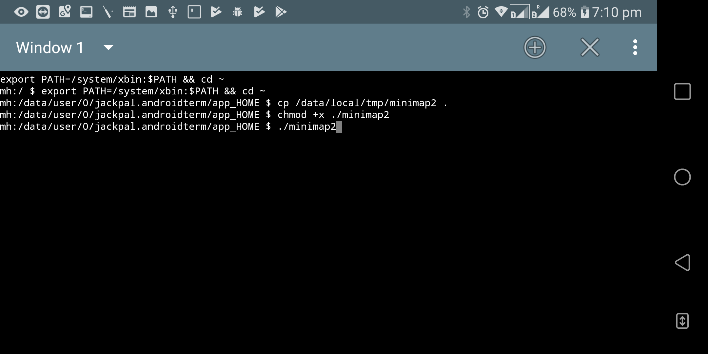
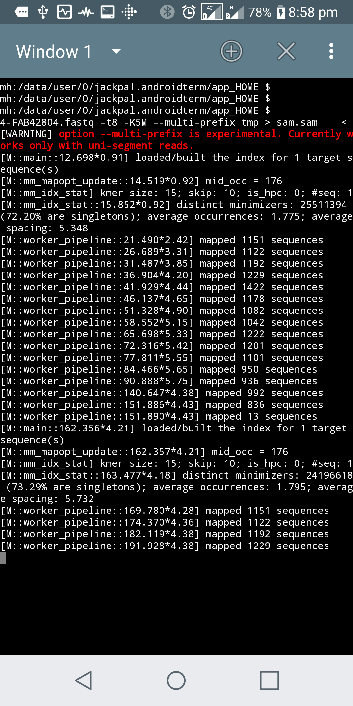
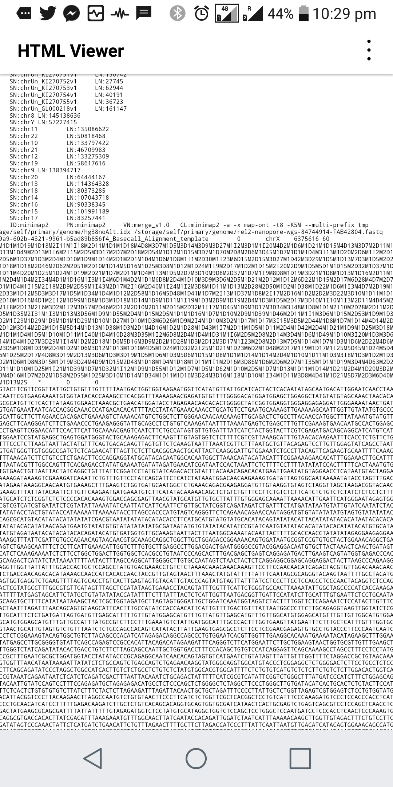
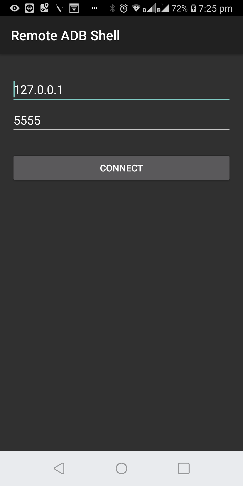
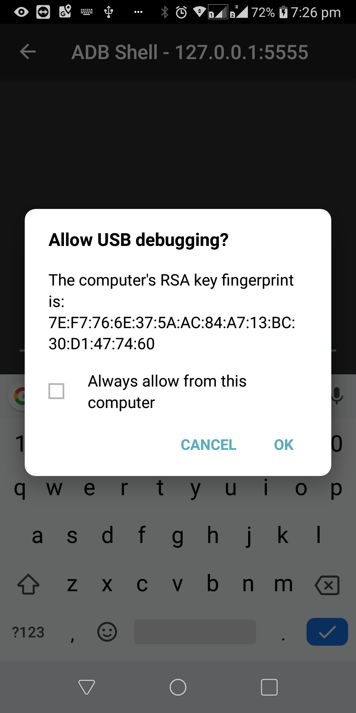
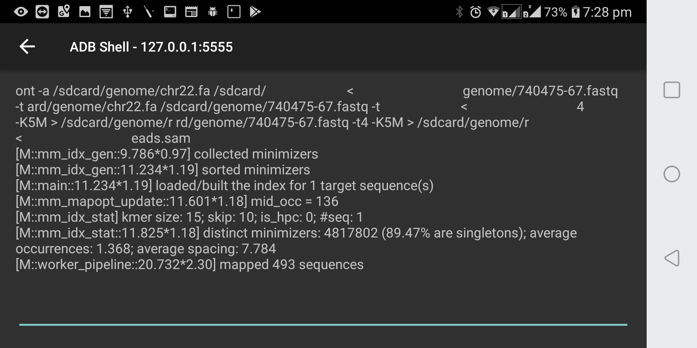

In the [previous post](../linux-tools-on-phone), I showed how Linux command line bioinformatics tools (such as minimap2) can be run on an Android mobile phone through Android Debug Bridge. That method required us to issue commands to the phone from the host PC via USB. In this post, I will show how we can make it a bit fancier, by issuing commands directly from the mobile phone. In summary, we will install a virtual terminal app to the phone and issue commands from there.

This post assumes that the binaries have been already copied to `/data/local/tmp` on your mobile phone by following the steps in the [previous post](../linux-tools-on-phone).

# On Android 7.0 or before

- Install a terminal emulator on your Android phone, for instance, [Terminal Emulator for Android](https://play.google.com/store/apps/details?id=jackpal.androidterm&hl=en_AU).

- Launch the terminal emulator app.

- On the terminal emulator append `/system/xbin` to `PATH` (the location of tools such as `cp` - might vary on your phone). Then change the current directory to the home, copy the binary, give executable permission and then launch the tool. An example for minimap2 is below.

```bash
export PATH=/system/xbin:$PATH && cd ~
cp /data/local/tmp/minimap2 .
chmod +x minimap2
./minimap2
```


{:height="50%" width="50%"}{:height="50%" width="50%"}


# On Android 8.x

The Above method, unfortunately, will not work on the latest Android 8. You may get a "Bad System Call" error when you attempt to run a binary using the terminal emulator. This is due to the [seccom filter](https://android-developers.googleblog.com/2017/07/seccomp-filter-in-android-o.html) introduced in Android 8.0. If you have a rooted phone surely you can get over this by running as sudo. But luckily, still there is a way for non rooted phones - use an app that emulates the ADB client, for instance, [Android Remote Debugger](https://play.google.com/store/apps/details?id=com.cgutman.androidremotedebugger&hl=en). Limitation of this method is you need a host PC (with ADB configured) to initially launch ADB server on the phone.


1. Install [Android Remote Debugger](https://play.google.com/store/apps/details?id=com.cgutman.androidremotedebugger&hl=en) on your phone

2. Connect the phone through USB to the host computer (need to have ADB configured as we did in the [previous post](../linux-tools-on-phone)) and on a command prompt issue the following.

```bash
C:\Program Files (x86)\Minimal ADB and Fastboot>adb tcpip 5555
restarting in TCP mode port: 5555
```

You can disconnect from the computer after launching the server as above. However, you will need to perform this step every time you reboot your phone.

3. Launch the Android Remote Debugger app and connect to the locahost(127.0.0.1) on port 5555.

{:height="50%" width="50%"}{:height="50%" width="50%"}

4. Now change directory to `/data/local/tmp` and execute the binary.




# Is there a proper way?

All the methods above are hacky and suitable only in a development environment. While I have not myself investigated proper ways, here are some thoughts.

- Compile the binaries and link against *bionic*, the standard C library for Android (opposed to static linking). We have to use a cross compiler for this, i.e. gcc-arm-linux-androideabi. however the dependencies (such as *zlib*) have to be compiled ourselves using the cross compiler (cannot use the versions from *apt*). However, additional requirements such as mandated position independent executables and [restrictions on text relocations](https://android.googlesource.com/platform/bionic/+/master/android-changes-for-ndk-developers.md) will further complicate the compilation. After getting it compiled, you would make an Android application that acts as a wrapper that calls the compiled binaries, for instance, what is suggested [here](https://stackoverflow.com/questions/5583487/hosting-an-executable-within-android-application).

- The most proper way (but a lot of work for sure) would be to use the [Android NDK](https://developer.android.com/ndk/guides) to compile the C codes into native libraries (might require a restructuring of the source code) which then can be called through an Android app through JNI.
